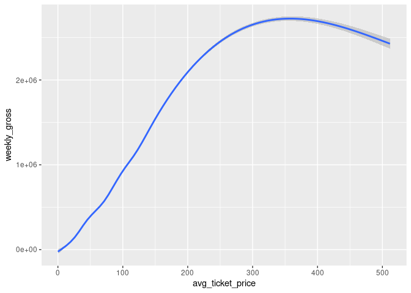

Project proposal
================
team

``` r
library(tidyverse)
library(broom)
library(tidytuesdayR)
```

``` r
grosses <- readr::read_csv('https://raw.githubusercontent.com/rfordatascience/tidytuesday/master/data/2020/2020-04-28/grosses.csv', guess_max = 40000)
```

*For instructions on what each section should include, please see the
[project page](https://idsed.digital/assessments/project/#proposal) on
the course website. Remove this text when completing your proposal*.

## 1. Introduction

General Research Question: How to maximise gross weekly revenue in a
Broadway show?

The dataset used comes from Playbill, which is a US magazine for
theatre-goers. The information of weekly box office grosses comes from
‘The Broadway League’, an association for Broadway theatres.

There are 47,524 cases of shows that are being played in the theatres at
different times in a year.

There are 14 variables. Some of the more important ones which we will be
using in our analysis include the following:

1.  `show`
2.  `theatre`
3.  `weekly_gross`
4.  `avg_ticket_price`
5.  `seats_sold`
6.  `seat_capacity`
7.  `performances`

## 2. Data

``` r
glimpse(grosses)
```

    ## Rows: 47,524
    ## Columns: 14
    ## $ week_ending          <date> 1985-06-09, 1985-06-09, 1985-06-09, 1985-06-09, …
    ## $ week_number          <dbl> 1, 1, 1, 1, 1, 1, 1, 1, 1, 1, 1, 1, 1, 1, 1, 1, 1…
    ## $ weekly_gross_overall <dbl> 3915937, 3915937, 3915937, 3915937, 3915937, 3915…
    ## $ show                 <chr> "42nd Street", "A Chorus Line", "Aren't We All?",…
    ## $ theatre              <chr> "St. James Theatre", "Sam S. Shubert Theatre", "B…
    ## $ weekly_gross         <dbl> 282368, 222584, 249272, 95688, 61059, 255386, 306…
    ## $ potential_gross      <dbl> NA, NA, NA, NA, NA, NA, NA, NA, NA, NA, NA, NA, N…
    ## $ avg_ticket_price     <dbl> 30.42, 27.25, 33.75, 20.87, 20.78, 31.96, 28.33, …
    ## $ top_ticket_price     <dbl> NA, NA, NA, NA, NA, NA, NA, NA, NA, NA, NA, NA, N…
    ## $ seats_sold           <dbl> 9281, 8167, 7386, 4586, 2938, 7992, 10831, 5672, …
    ## $ seats_in_theatre     <dbl> 1655, 1472, 1088, 682, 684, 1018, 1336, 1368, 148…
    ## $ pct_capacity         <dbl> 0.7010, 0.6935, 0.8486, 0.8405, 0.5369, 0.9813, 1…
    ## $ performances         <dbl> 8, 8, 8, 8, 8, 8, 8, 8, 8, 8, 8, 8, 8, 9, 0, 8, 8…
    ## $ previews             <dbl> 0, 0, 0, 0, 0, 0, 0, 0, 0, 0, 0, 0, 0, 0, 8, 0, 0…

## 3. Data analysis plan

In general, we set “weekly gross revenue” as the response Y, “average
ticket price”, “seats sold”, and “number of performances per week” as
the corresponding X. For further analysis, we consider “average ticket
price” as the response Y, “seat capacity”, “name of theater”, “number of
week being run” as the corresponding X, to more specifically figure out
how each factors contribute to maximize weekly gross revenue.

Our hypotheses are: Higher “average ticket price”, “seats sold”, and
“number of performances per week” lead to higher “gross weekly revenue”.
More specifically, higher “seat capacity” and “number of week being run”
can lead to higher “average ticket price”, and the type of “theater”
matters as well.

We will use inferential statistics method which helps show relationship
and tendency of data. R visualization helps show the relationship and
tendency.For example, to visualize the relation between “average ticket
price” and “gross weekly revenue”, we use code:

``` r
grosses%>%
  ggplot(aes(y=weekly_gross,x=avg_ticket_price))+
  geom_smooth()
```

    ## `geom_smooth()` using method = 'gam' and formula 'y ~ s(x, bs = "cs")'

<!-- --> By the
preliminary visualization, we get a curve which increases first but
decreases after price of 350. We are going to explore the reason causes
the decrease later.

To support our hypothesis before, we have to draw graphs of the
variables in the hypothesis correspondingly– the positive correlation
supports the hypothesis.
